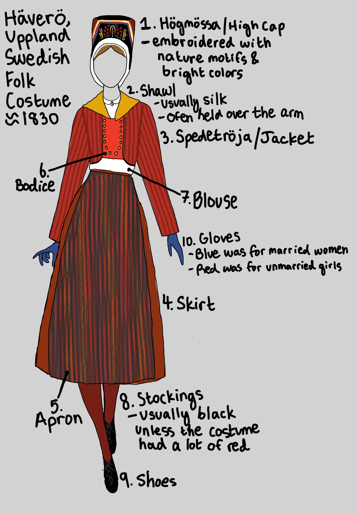

# Course Information

## Picture Glossary
### Week 2
#### Folk Costume

#### Ancient Middle East
### Week 3
### Week 4
### Week 5
### Week 6
### Week 7
### Week 8
### Week 9
### Week 10
### Week 11
### Week 12
### Week 13
