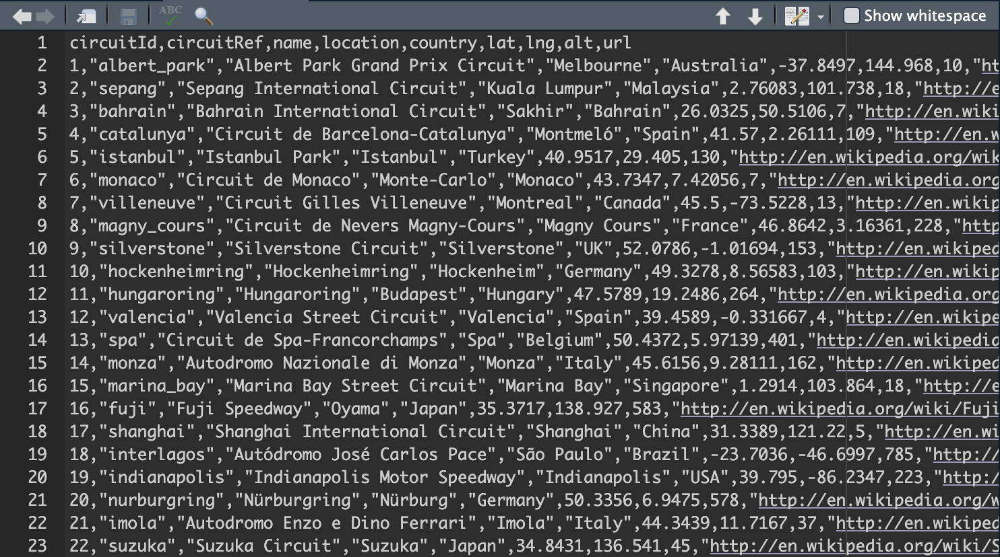
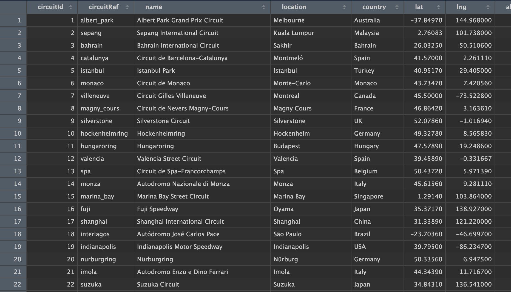

It's been a while since I made my ggplot tutorials! I made those over 4 years ago, and kind of forgot how to do anything with data. However, I recently started watching Formula One, which just so happens to be a sport built off of data and analysis. So, naturally I had to relearn R and data wrangling. This whole endeavor involved a *lot* of Google-ing. Like, I spent an embarrassing amount of time on Stack Overflow and Reddit (both of which are great resources on the off chance that you've entirely forgotten the R language!).

## Finding Data

It took me a really long time to find a dataset! There was an R package `f1dataR` but it hadn't been updated since the end of the 2024 season, but I wanted the 2025 season. I eventually found [this dataset](https://www.kaggle.com/datasets/jtrotman/formula-1-race-data?resource=download) on Kaggle, which had more recent races.

## CSV

CSV files—short for Comma-Separated Values—are a plain text file that stores data in a table format. Basically, all the columns and rows are separated by commas, as seen below:

{width=400, fig-align="left"}


which can then be formatted as a table dataset, similar to an Excel spreadsheet:

{width=400, fig-align="left"}

The Kaggle dataset I downloaded had a bunch of CSV files I had to get into R. After downloading, I moved the .zip file to my R project, and unzipped it, which created a folder called archive with all the raw CSV files in it. Now, I had forgotten how to use CSV files, but apparently the `readr` package has a function `read_csv` which, uh, does just that. 

So the first step was to load a bunch of files into my Environment panel, which I did with `read_csv`. `tidyverse` has the `readr` package in it, so that is one of 2 packages I used during this adventure.

```{r libraries, warning = FALSE, message = FALSE}
library(tidyverse)
qualifying <- read_csv("archive/qualifying.csv")
races <- read_csv("archive/races.csv")
results <- read_csv("archive/results.csv")
```

This makes these 3 tables viewable and usable. But these tables don't have all the columns I want.

## Functions for Wrangling

### `left_join()`

The `left_join()` function comes from the `dplyr` package, also part of the `tidyverse`. It allows you to combine different datasets with matching columns. I tried combining all 3 but there were duplicate columns with different meanings, so I combined Qualifying and Races first. The dataset contains a unique ID for each race, so I was able to combine the datasets using that column.

```{r quali-race, warning = FALSE, message = FALSE}
quali <- left_join(qualifying, races, by = "raceId")

glimpse(quali)
```

11,298 rows! That was waaaaay too much, because I am only focused on the 2025 season. 

### `filter()` and `select()`

`filter()` is another function from `dplyr`, which allows you to keep or drop rows that match specific conditions. 

```{r}
quali_results_25 <- quali |> 
  filter(year == "2025")
```

`select()` lets you pick certain columns to keep in a dataset.

```{r}
quali_results_25 <- quali |> 
  filter(year == "2025") |> 
  select(number, position, q1, round, name, date, raceId)

glimpse(quali_results_25)
```

Now, I have to deal with the duplicate column names.

### Dealing with the other dataset

The issue with combining races, qualifying, and results was that the column "Position" had different values in the "Results" table. It was referring to the final position, but the column in "Qualifying" was the starting position (If I am recalling that correctly). So, all I had to do was rename the column in "Results". But, I decided to do my filtering and selecting before I joined them together, to make it a bit easier.

The "Results" dataset didn't have a year column, so I had to find the unique Race ID, and filter it so that values between those two numbers would be kept.

```{r}
results25 <- results |> 
  filter(between(raceId, 1145, 1168)) |> 
  select(raceId, driverId, number, grid, position, points, laps)
```

Renaming was very easy, you just have to use the `rename()` function!

```{r}
results25 <- results |> 
  filter(between(raceId, 1145, 1168)) |> 
  select(raceId, driverId, number, grid, position, points, laps) |> 
  rename(final_position = position)
```

I joined by number and race ID

```{r}
quali_and_race <- left_join(results25, quali_results_25, by = c("number", 
                                                                "raceId")) 
```

Now we have a larger dataset with all the variables we need to make a (not very fancy) graph. But there were still many issues that had to be resolved.

## Numeric to Character

Whenever I tried making a graph with this data, the numbers would be all messed up, because the columns I was using were all character columns, when I needed them to be numeric. I also decided I only wanted data from the McLaren drivers, so I filtered for their numbers.

```{r}
mcl_quali_race <- quali_and_race |> 
  filter(number %in% c(4, 81)) |> 
  mutate(grid = as.numeric(grid))
```

However, this whole thing introduced a lot of errors. Because I hadn't done this for years I had no idea what any of the warning messages meant, so that added a lot to my Google-ing time. Essentially, I just ignored it! This is probably not best practice but I was running into a loop where I couldn't fix the NA values because the column was numeric, and fixing the NA values required it to be character, which I could only change if the NA values were fixed. I still don't really know what happened there, but the error doesn't really break anything as far as I know. We will fix the NAs later and just ignore the error. But first, I changed the cell values for the Driver Numbers, because I wanted their names in there as well.

```{r}
mcl_quali_race <- quali_and_race |> 
  filter(number %in% c(4, 81)) |> 
  mutate(grid = as.numeric(grid)) |> 
  mutate(number = if_else(number == 4, "Lando Norris (LN4)", as.character(number))) |> 
  mutate(number = if_else(number == 81, "Oscar Piastri (OP81)", as.character(number)))
```

## Fixing some issues

The dataset was missing values for the entire Qatar Grand Prix, and didn't have labels for DNFs or DSQs, so I had to add those manually like so:

```{r}
mcl_quali_race[46, "grid"] <- 2
mcl_quali_race[45, "grid"] <- 1
mcl_quali_race[43, "final_position"] <- "DSQ"
mcl_quali_race[44, "final_position"] <- "DSQ"
mcl_quali_race[34, "final_position"] <- "DNF"
mcl_quali_race[30, "final_position"] <- "DNF"
mcl_quali_race[20, "final_position"] <- "DNF"

glimpse(mcl_quali_race)
```

Now, the NAs are filled (in theory) and the error message should be inaccurate at this point but then again, I just ignored it because it didn't break anything, so I'm not entirely sure if this is the best way to go about fixing stuff.

## Graphing

I'm not going to explain how I made this graph because I just used my own [ggplot tutorial](https://www.miriamheiss.com/posts/graphing-with-ggplot/) and [ggplotly tutorial](https://www.miriamheiss.com/posts/ggplotly-ggplot/). But there are two important things to note. `scale_x/y_continuous` is used for numeric data, and `scale_x/y_discrete` is used for character data. It's important to know what kind of data you have in your datasets because otherwise you will be sad (I don't acutally know how you'll feel, but *I* was sad)

```{r warning = FALSE, message = FALSE}
library(plotly)
graph1 <- mcl_quali_race |> 
  ggplot(aes(x = grid,
             y = final_position,
             text = paste("Round", round, name),
             color = as.factor(number))) +
geom_point()+
  scale_x_continuous(breaks = c(1:10))+
  scale_y_discrete(limits = c("DSQ", "DNF", "10", "9", "8", "7", "6", "5",
                               "4", "3", "2", "1"))+
  labs(x = "Starting Grid",
       y = "Final Position",
       color = "Driver")+
  scale_color_manual(values = c("#FF8B00", "#1E1E1E"))+
  theme_bw()

ggplotly(graph1, tooltip = "text")
```
\

Nice!

{width=200}


This is not the fanciest or the nicest plot I've made, but it has definitely helped me to relearn some of my skills. The moral of this story is to just continue practicing. I wouldn't recommend letting your skills go unused for years and years. 
